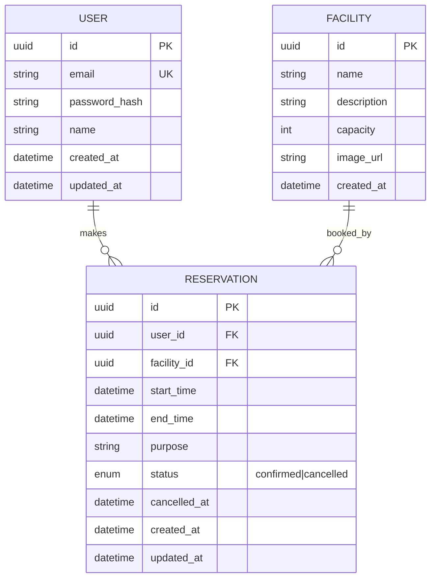

# DB設計・ER図



## 設計ポイント
- `RESERVATION.status` は enum（confirmed / cancelled）。物理削除は行わない（監査・履歴のため）
- `RESERVATION.cancelled_at` はキャンセル日時を記録。キャンセル率の統計や管理者の確認に使用する
- `USER.password_hash` は平文パスワードを絶対に保存しない
- `RESERVATION` には部分インデックス（PostgreSQL）を検討：`facility_id + start_time` の重複をDBレベルで防ぐ。ただし、**開始時刻の完全一致のみ防げる**。開始時刻は異なるが時間帯が重複する予約（例：10:00-11:00 と 10:30-11:30）は防げないため、**アプリケーション層でも範囲重複チェックが必須**である

---

## 用語集（Glossary）

### ER図（Entity-Relationship Diagram）
データベースのテーブル（エンティティ）とテーブル間の関係（リレーションシップ）を図で表現したものです。

**記号の意味**:
- `||--o{` : 1対多の関係（1側が必ず存在し、多側は0以上）
- `PK` : Primary Key（主キー）。テーブル内でレコードを一意に識別するカラム
- `FK` : Foreign Key（外部キー）。他のテーブルの主キーを参照するカラム
- `UK` : Unique Key（一意キー）。重複を許さないカラム（主キー以外）

### UUID（Universally Unique Identifier）
128ビットの識別子。例: `550e8400-e29b-41d4-a716-446655440000`

**なぜ使うのか**: 連番（auto increment）より衝突のリスクが極めて低く、分散システムでも安全にIDを生成できます。ただし、インデックスのパフォーマンスは連番よりやや劣ります。

### enum（列挙型）
定義された値の中からのみ選択できるデータ型。PostgreSQLでは `CREATE TYPE status AS ENUM ('confirmed', 'cancelled')` のように定義します。

**なぜ使うのか**: 文字列（string）よりも型安全で、「予期しない値が入る」をDBレベルで防げます。ただし、値の追加は可能ですが削除・変更は手間がかかります。

### 部分インデックス（Partial Index）
テーブルの一部のレコードにのみ適用されるインデックス。`WHERE` 条件を付けて定義します。

**例**: `CREATE UNIQUE INDEX ... WHERE status = 'confirmed'` → `cancelled` のレコードはインデックスの対象外になります。

**なぜ使うのか**: インデックスのサイズを小さくし、更新時のオーバーヘッドを減らせます。「キャンセル済みは重複を許可する」ような場合に有効です。

### 論理削除 vs 物理削除
| | 論理削除 | 物理削除 |
|---|---|---|
| **仕組み** | `status = 'deleted'` 等のフラグを立てる | `DELETE` 文でレコードを削除 |
| **データ復元** | 可能（フラグを元に戻す） | 不可能（バックアップが必要） |
| **ディスク容量** | 増える | 減る |
| **クエリ速度** | インデックスを貼る必要あり | 問題なし |
| **用途** | 監査・履歴が必要な場合 | 一時的なデータ（ログ等） |

**本ケースでの結論**: 予約データは「誰がいつキャンセルしたか」の監査が必要なため、論理削除を採用します。

---

## 設計の深掘り

### なぜ `FACILITY` と `RESERVATION` を分離するのか
施設情報と予約情報を同じテーブルに持つ（非正規化）ことも可能ですが、分離する理由は：

1. **データの整合性**: 施設名や定員が変更された場合、1箇所（`FACILITY` テーブル）だけ更新すればよい
2. **検索の効率**: 「東京都の会議室」を検索する際、予約データと混在しないため高速
3. **拡張性**: 施設に「営業時間」「設備（ホワイトボード、プロジェクタ等）」等を追加しやすい

### なぜ `password_hash` ではなく `password` ではないのか
平文のパスワードを保存することは、セキュリティ上絶対に避けるべきです。

**理由**:
- DBが漏洩した場合、全ユーザーのパスワードが即座に暴露される
- 多くのユーザーは同じパスワードを複数サイトで使い回しているため、他のサイトにも影響
- ハッシュ化しても、bcrypt等の「ソルト＋ストレッチング」がないと簡単に元のパスワードが推測される

### `start_time` と `end_time` の型は何が適切か
PostgreSQLでは `TIMESTAMP WITH TIME ZONE`（`timestamptz`）を推奨します。

**なぜか**: 単なる `TIMESTAMP` ではタイムゾーン情報が失われます。例えば、日本時間の「10:00」がUTCでは「01:00」になりますが、タイムゾーン付きで保存しておけば、どのタイムゾーンからでも正しく解釈できます。

**ただし**: アプリケーション層で常に統一されたタイムゾーン（通常UTC）で扱い、フロントエンドでユーザーのローカルタイムゾーンに変換するのがベストプラクティスです。

---

## 具体例シナリオ

### シナリオ1: 施設情報の変更
**状況**: 会議室Aの定員が「4人」から「6人」に変更された。

**流れ**:
1. 管理者が `FACILITY` テーブルの `capacity` を 4 → 6 に更新
2. 既存の予約データ（`RESERVATION` テーブル）は**一切変更しない**
3. 新しい予約が作成される際、新しい定員「6人」が適用される

**なぜ既存の予約を変更しないのか**: 過去の予約は「4人で予約した」という契約なので、勝手に変更すると履歴の整合性が崩れます。定員変更は「将来の予約」にのみ適用されます。

### シナリオ2: 重複予約の防止
**状況**: ユーザーAが「会議室Aの10:00-11:00」を予約しようとしている。既にユーザーBが「10:30-11:30」を予約済み。

**流れ**:
1. ユーザーAが予約画面で10:00-11:00を選択
2. アプリケーション層で以下のクエリを実行:
   ```sql
   SELECT * FROM Reservation
   WHERE facility_id = '会議室AのID'
     AND status = 'confirmed'
     AND start_time < '11:00'
     AND end_time > '10:00'
   ```
3. ユーザーBの予約（10:30-11:30）がヒット → `end_time > 10:00` かつ `start_time < 11:00` なので重複！
4. エラーレスポンスを返す: `{ error: { code: 'RESERVATION_CONFLICT', message: '指定された時間帯は既に予約されています' } }`

**なぜこのクエリで重複が分かるのか**: 2つの時間帯が重複する条件は「一方の開始時刻が他方の終了時刻より前」かつ「一方の終了時刻が他方の開始時刻より後」です。これは数学的に「区間の重複条件」として正しいです。
