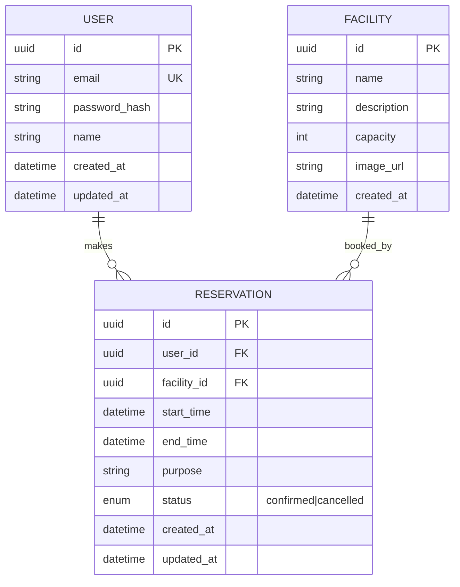

# DB設計・ER図

## 設計ポイント
- `RESERVATION.status` は enum（confirmed / cancelled）。物理削除は行わない（監査・履歴のため）
- `USER.password_hash` は平文パスワードを絶対に保存しない
- `RESERVATION` に複合ユニーク制約を検討：`facility_id + start_time` の重複をDBレベルで防ぐ。ただし、キャンセル済みは除く必要があるため、部分インデックス（PostgreSQL）を使う
