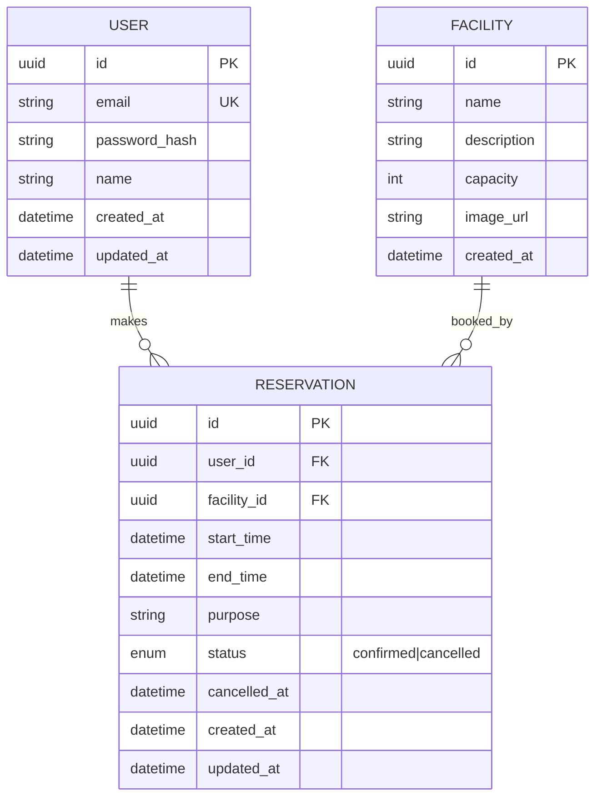

# DB設計・ER図

## 設計ポイント
- `RESERVATION.status` は enum（confirmed / cancelled）。物理削除は行わない（監査・履歴のため）
- `RESERVATION.cancelled_at` はキャンセル日時を記録。キャンセル率の統計や管理者の確認に使用する
- `USER.password_hash` は平文パスワードを絶対に保存しない
- `RESERVATION` には部分インデックス（PostgreSQL）を検討：`facility_id + start_time` の重複をDBレベルで防ぐ。ただし、**開始時刻の完全一致のみ防げる**。開始時刻は異なるが時間帯が重複する予約（例：10:00-11:00 と 10:30-11:30）は防げないため、**アプリケーション層でも範囲重複チェックが必須**である
