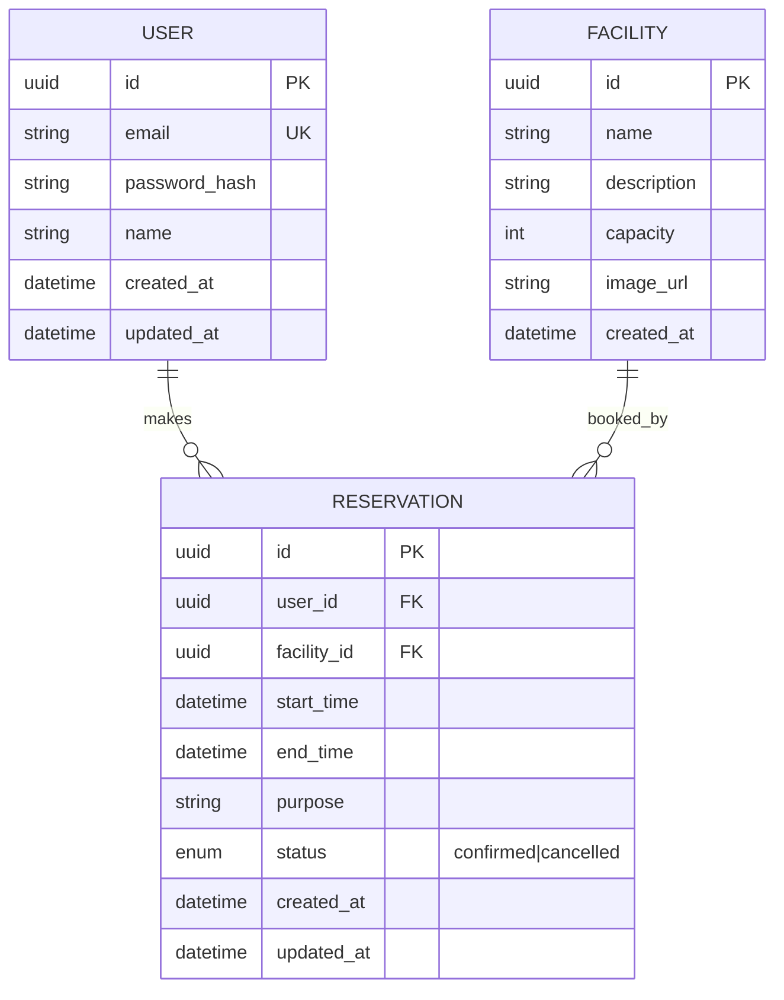

# 模範解答：DB設計



## 設計意図

### なぜ `status` enum なのか
物理削除（`DELETE`）を使わず、**論理削除**（status = cancelled）にする理由：
- 管理者が「誰がいつキャンセルしたか」を後から確認したい場合がある
- 予約数の統計（キャンセル率等）を取りたい
- ただし、GDPR等の観点から、完全な個人情報削除が必要な場合は別途「アカウント削除API」で対応

### なぜ `RESERVATION` に updated_at があるのか
予約変更履歴を追跡するため。ただし、**完全な履歴管理（履歴テーブル）**が必要な場合は `ReservationHistory` テーブルを追加する。

### 重複防止の実装
PostgreSQLの部分インデックスを使用：
```sql
CREATE UNIQUE INDEX idx_no_duplicate_reservations
ON Reservation(facility_id, start_time)
WHERE status = 'confirmed';
```
- `cancelled` は重複を許可（同じ時間帯を再度予約可能にするため）
- アプリケーション層でもバリデーションを行う（二重チェック）
