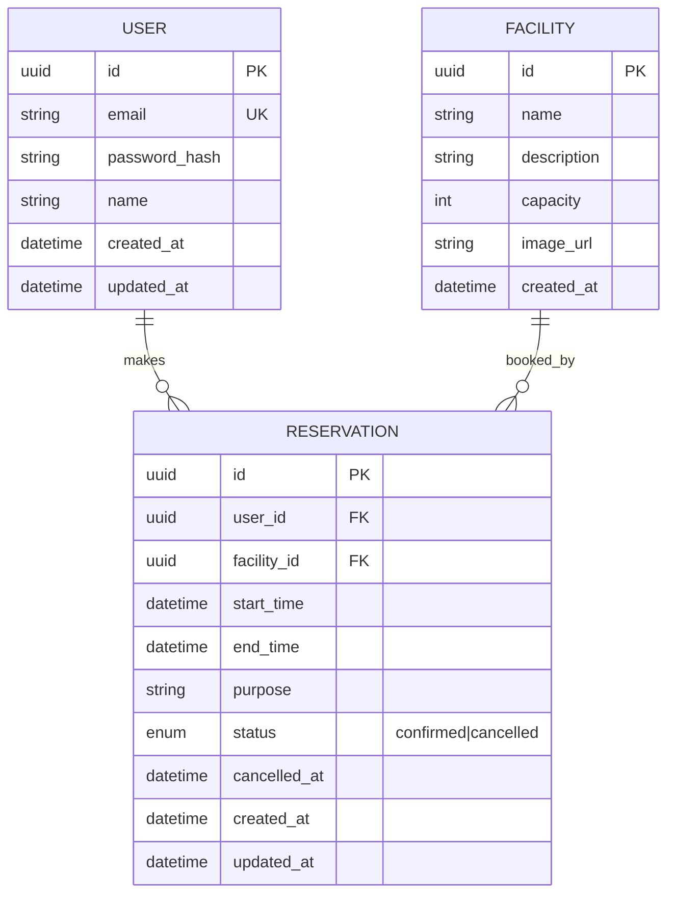

# 模範解答：DB設計



## 設計意図

### なぜ `status` enum なのか
物理削除（`DELETE`）を使わず、**論理削除**（status = cancelled）にする理由：
- 管理者が「誰がいつキャンセルしたか」を後から確認したい場合がある
- 予約数の統計（キャンセル率等）を取りたい
- `cancelled_at` を持つことで、正確なキャンセル日時を記録できる
- ただし、GDPR等の観点から、完全な個人情報削除が必要な場合は別途「アカウント削除API」で対応

### なぜ `RESERVATION` に updated_at があるのか
予約変更履歴を追跡するため。ただし、**完全な履歴管理（履歴テーブル）**が必要な場合は `ReservationHistory` テーブルを追加する。

### 重複防止の実装
#### 1. DBレベル：部分インデックス（開始時刻の完全一致のみ）
```sql
CREATE UNIQUE INDEX idx_no_duplicate_start_time
ON Reservation(facility_id, start_time)
WHERE status = 'confirmed';
```
- 同じ施設で**開始時刻が完全に一致する**予約を防ぐ
- `cancelled` は重複を許可（同じ時間帯を再度予約可能にするため）
- **重要**：このインデックスだけでは、開始時刻は異なるが時間帯が重複する予約（例：10:00-11:00 と 10:30-11:30）は防げない

#### 2. アプリケーション層：範囲重複チェック（必須）
予約作成・変更時に、以下のクエリで既存予約との重複を確認する：
```sql
SELECT * FROM Reservation
WHERE facility_id = ?
  AND status = 'confirmed'
  AND start_time < ?   -- 新予約の終了時刻
  AND end_time > ?;    -- 新予約の開始時刻
```
- この条件を満たすレコードがあれば、時間帯が重複している
- DB制約とアプリケーション層の**二重チェック**が必要
- さらに厳密に行う場合は、トランザクション内で `SELECT FOR UPDATE`（悲観ロック）を使い、チェックからINSERTまでの競合を防ぐ

---

## 模範解答のポイント

### なぜこれが模範解答か
本設計が「良い設計」と言える理由：

1. **現実の問題を解決している**: 「重複予約」という実務で頻出する問題に対し、DB制約とアプリケーション層の両方で対策している
2. **拡張性がある**: `status` enum を使うことで、将来的に `no_show`（予約したが来なかった）等の状態を追加しやすい
3. **監査要件を満たしている**: `cancelled_at` や `updated_at` により、管理者が「いつ誰が何をしたか」を追跡できる
4. **パフォーマンスを考慮している**: 部分インデックスにより、インデックスのサイズを抑えつつ重複を防いでいる

### 初学者が陥りやすい間違いとの対比

| 項目 | ❌ 初学者が陥りがち | ✅ 模範解答 |
|------|------------------|-----------|
| **予約重複防止** | 「`facility_id + start_time` の一意制約で防げる」と思い込む | 一意制約は「開始時刻完全一致」しか防げないことを明示し、アプリケーション層での範囲重複チェックも必須としている |
| **キャンセル処理** | `DELETE` で物理削除 | `status = 'cancelled'` で論理削除。`cancelled_at` で日時も記録 |
| **パスワード保存** | 平文またはSHA-256 | bcrypt等の専用ハッシュ関数 |
| **トークン管理** | localStorageにrefreshToken | HttpOnly CookieにrefreshToken、メモリにaccessToken |

### さらなる深掘り（上級者向け）

#### 部分インデックス vs EXCLUDE制約
PostgreSQLには、より強力な「範囲重複防止」の仕組みとして `EXCLUDE` 制約があります：

```sql
CREATE EXTENSION IF NOT EXISTS btree_gist;

ALTER TABLE Reservation
ADD CONSTRAINT no_overlapping_reservations
EXCLUDE USING gist (
  facility_id WITH =,
  tsrange(start_time, end_time) WITH &&
)
WHERE (status = 'confirmed');
```

**メリット**: アプリケーション層の範囲重複チェックなしで、DBレベルで「時間帯の重複」を完全に防げます。

**デメリット**: 
- GiSTインデックスの作成・更新コストが高い
- `tsrange` 型の理解が必要
- PostgreSQL固有の機能であり、他のDB（MySQL等）に移植できない

**結論**: 小〜中規模のシステムでは「部分インデックス + アプリケーション層チェック」で十分。大規模または「絶対に重複を許容できない」要件の場合は `EXCLUDE` 制約を検討。

#### 論理削除の代替案：履歴テーブル
現状の設計では `status = 'cancelled'` で論理削除していますが、より厳密な履歴管理が必要な場合は以下を検討します：

```sql
CREATE TABLE ReservationHistory (
  id UUID PRIMARY KEY,
  reservation_id UUID NOT NULL,
  changed_by UUID NOT NULL,
  old_status VARCHAR(20),
  new_status VARCHAR(20),
  changed_at TIMESTAMP NOT NULL DEFAULT NOW()
);
```

**メリット**: 誰がいつどの状態からどの状態に変更したか、完全に追跡可能。

**デメリット**: テーブルが増え、クエリが複雑になる。

**結論**: 監査要件が厳格な場合（医療、金融等）に採用。一般的なWebサービスでは `updated_at` + `status` で十分なことが多い。
