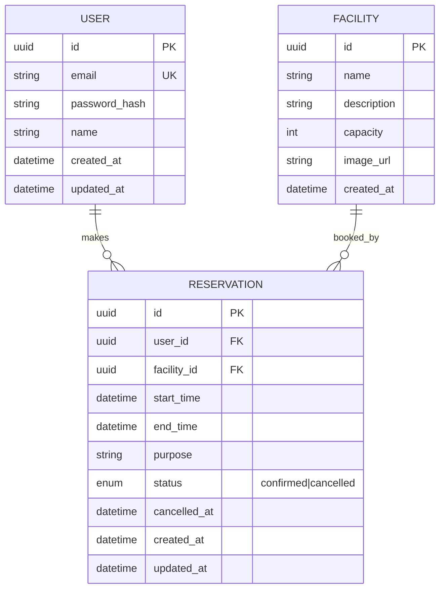

# 模範解答：DB設計



## 設計意図

### なぜ `status` enum なのか
物理削除（`DELETE`）を使わず、**論理削除**（status = cancelled）にする理由：
- 管理者が「誰がいつキャンセルしたか」を後から確認したい場合がある
- 予約数の統計（キャンセル率等）を取りたい
- `cancelled_at` を持つことで、正確なキャンセル日時を記録できる
- ただし、GDPR等の観点から、完全な個人情報削除が必要な場合は別途「アカウント削除API」で対応

### なぜ `RESERVATION` に updated_at があるのか
予約変更履歴を追跡するため。ただし、**完全な履歴管理（履歴テーブル）**が必要な場合は `ReservationHistory` テーブルを追加する。

### 重複防止の実装
#### 1. DBレベル：部分インデックス（開始時刻の完全一致のみ）
```sql
CREATE UNIQUE INDEX idx_no_duplicate_start_time
ON Reservation(facility_id, start_time)
WHERE status = 'confirmed';
```
- 同じ施設で**開始時刻が完全に一致する**予約を防ぐ
- `cancelled` は重複を許可（同じ時間帯を再度予約可能にするため）
- **重要**：このインデックスだけでは、開始時刻は異なるが時間帯が重複する予約（例：10:00-11:00 と 10:30-11:30）は防げない

#### 2. アプリケーション層：範囲重複チェック（必須）
予約作成・変更時に、以下のクエリで既存予約との重複を確認する：
```sql
SELECT * FROM Reservation
WHERE facility_id = ?
  AND status = 'confirmed'
  AND start_time < ?   -- 新予約の終了時刻
  AND end_time > ?;    -- 新予約の開始時刻
```
- この条件を満たすレコードがあれば、時間帯が重複している
- DB制約とアプリケーション層の**二重チェック**が必要
- さらに厳密に行う場合は、トランザクション内で `SELECT FOR UPDATE`（悲観ロック）を使い、チェックからINSERTまでの競合を防ぐ
